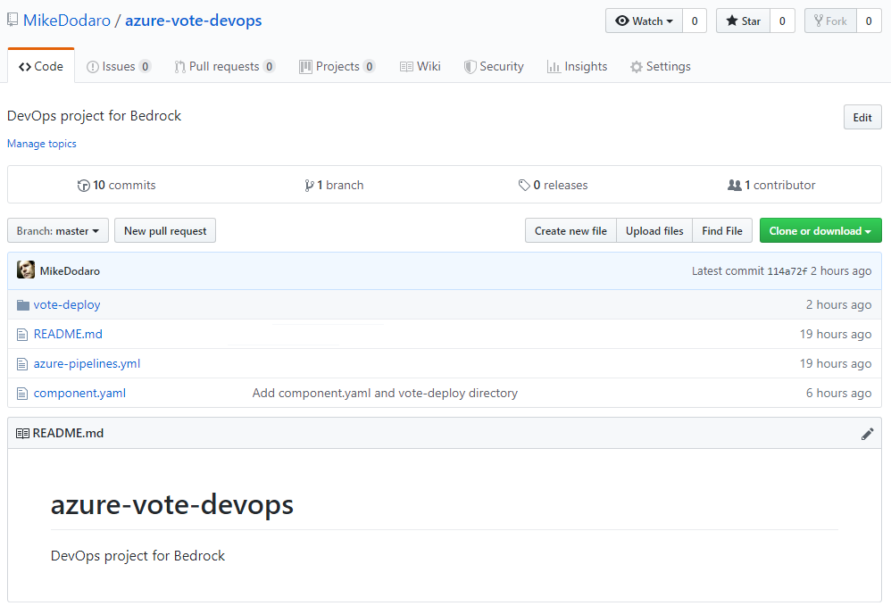
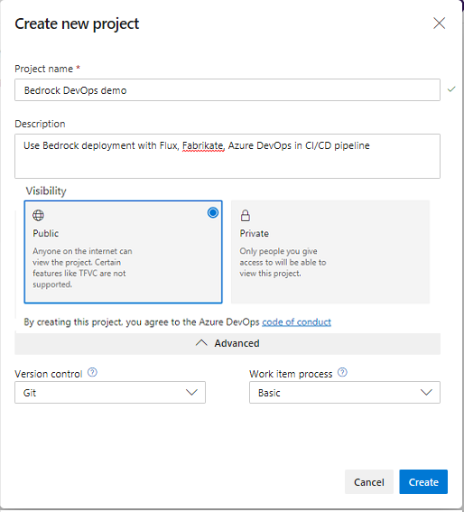
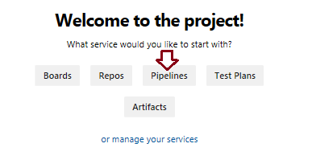
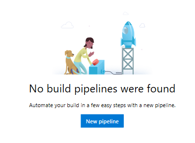
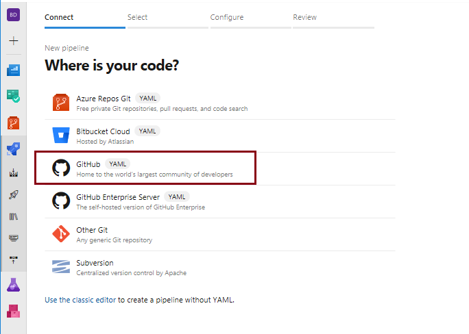
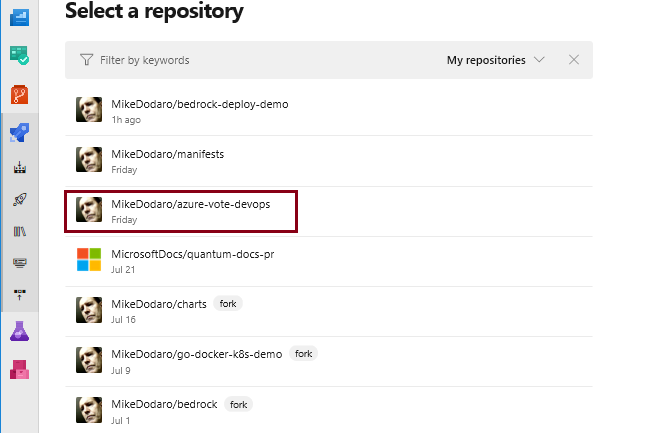
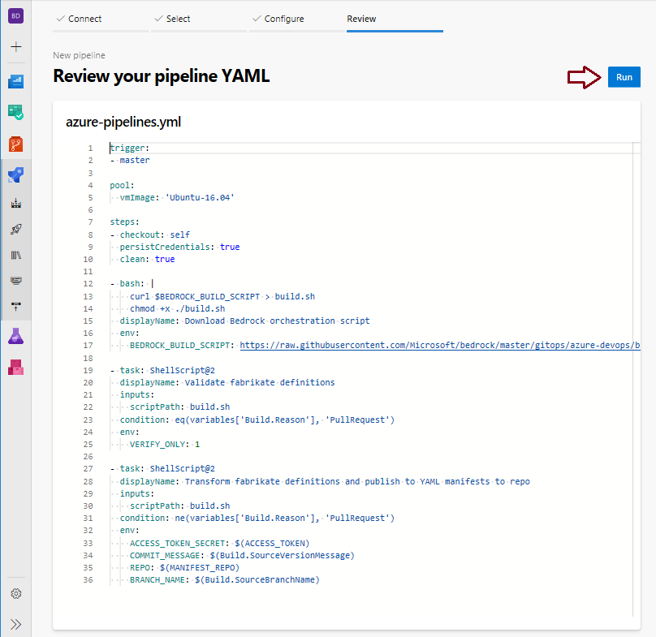
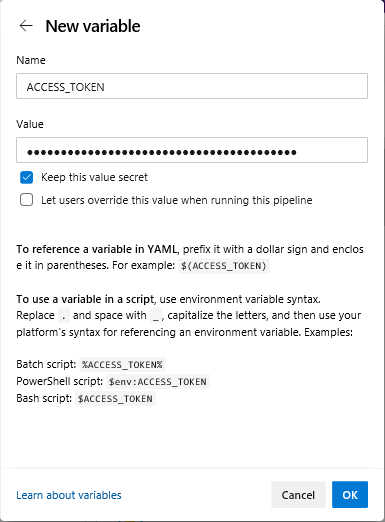
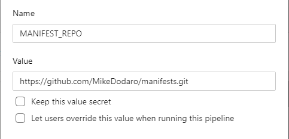
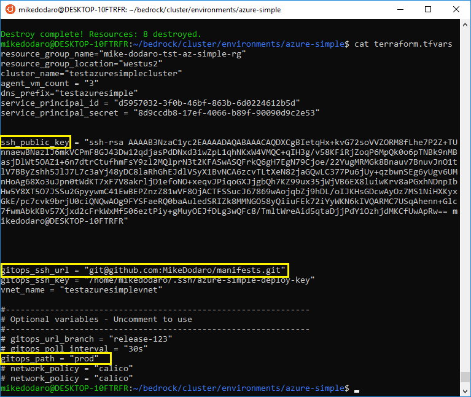

# Use Fabrikate in DevOps Pipeline to automate updates to Bedrock Deployment

This walkthrough uses an Azure DevOps pipeline and Fabrikate to automate changes to a running Bedrock deployment. A deployment such as [A Walkthrough Deploying a Bedrock Environment](../azure-simple/readme) can assign the `gitops_ssh_url` field in the `terraform.tfvars` file to a repo that receives the output of Fabrikate in a DevOps pipeline.  

When the pipeline runs, it calls `fab install` and `fab generate`, which we ran from the commandline in a previous example: [Build Fabrikate Definition for Container Deployment](../fabrikate/readme).  The manifest that results from the DevOps pipeline is sent to another repo and directory that Flux is watching.  Updates to the Bedrock deployment are automatic.

## Set up git repos for Pipeline

You'll need two repos for this example, one to run Fabrikate and another to receive the resulting `.yaml` files.  We're using the `azure-vote` application also used in [Build Fabrikate Definition for Container Deployment](../fabrikate/readme).  

### Fabrikate repo
In this example, the repo that runs Fabrikate in the DevOps pipeline uses a directory structure like the following screenshot.  For now, add a [simple web app manifest](../azure-simple/readme#deploy-an-update-using-kubernetes-manifest) to the `vote-deploy` directory.



### DevOps Template
The file `azure-pipelines.yml` is a template specification for the Azure DevOps pipeline.  The `trigger:` field in this manifest specifies the branch that is linked to the DevOps pipeline.  Presumably, commits to the `trigger` branch result from development work in progress.  

When changes occur in the `trigger` branch, the DevOps pipeline runs. Fabrikate uses manifests in the `vote-deploy` directory to build deployment manifests.  The pipeline pushes them to the [Manifests repo](#manifests-repo) described under the next heading.

```yaml
trigger:
- master

pool:
  vmImage: 'Ubuntu-16.04'

steps:
- checkout: self
  persistCredentials: true
  clean: true

- bash: |
    curl $BEDROCK_BUILD_SCRIPT > build.sh
    chmod +x ./build.sh
  displayName: Download Bedrock orchestration script
  env:
    BEDROCK_BUILD_SCRIPT: https://raw.githubusercontent.com/Microsoft/bedrock/master/gitops/azure-devops/build.sh

- task: ShellScript@2
  displayName: Validate fabrikate definitions
  inputs:
    scriptPath: build.sh
  condition: eq(variables['Build.Reason'], 'PullRequest')
  env:
    VERIFY_ONLY: 1

- task: ShellScript@2
  displayName: Transform fabrikate definitions and publish to YAML manifests to repo
  inputs:
    scriptPath: build.sh
  condition: ne(variables['Build.Reason'], 'PullRequest')
  env:
    ACCESS_TOKEN_SECRET: $(ACCESS_TOKEN)
    COMMIT_MESSAGE: $(Build.SourceVersionMessage)
    REPO: $(MANIFEST_REPO)
    BRANCH_NAME: $(Build.SourceBranchName)
```

### Component directive

The file `component.yaml` in this repo is a directive for Fabrikate operations.  It contains the path to the directory that contains the source manifests for the `fab generate` method, in this case the local `./vote-deploy` directory.

```yaml
name: azure-vote
type: static
method: local
path: ./vote-deploy
```

### Manifests repo
The second repo receives the resulting `.yaml` files that Fabrikate creates when the DevOps pipeline runs. It will be specified when you [Set up the DevOps Pipeline](#set-up-devops-pipeline).

Create this repo with a `prod` directory.  Put a `README.md` in it to make the `prod` directory visible in GitHub.

The Bedrock deployment that will be updated by manifests from this repo must authenticate and authorized Flux to query this repo.  From the [Bedrock deployment](../azure-simple/readme#create-an-rsa-key-pair-for-a-deploy-key-for-the-flux-repository), use `ssh-keygen` to generate a deploy key.  Add it to this repo as described in the deployment document under the heading [Add Repository Key](../azure-simple/readme#add-repository-key).  

## Set up Azure DevOps Pipeline

This example demonstrates a simple Continuous Integration/Continuous Deployment (CI/CD) pipeline.  It uses the high level definition (HLD) and Fabrikate repos that we set up in the previous section and Azure DevOps, assuming an active account. 

### New Project
Navigate to [Azure DevOps](https://dev.azure.com) and create a new project:


Name the project and select from the options the dialog provides, in this case `Private` visibility and `Git` version control.


### Pipeline
Select `Pipelines`:



Then select `New Pipeline`:




### Code for Pipeline

This project uses gitHub .yaml files find souce manifests and direct out put of Fabrikate methods.  Select the `GitHub YAML` option as code location:



### Select a Repository

This step identifies the repository that will trigger DevOps builds for this project.  From the dialog select the repository configured with the DevOps template in the previous heading [Fabrikate repo](#fabrikate-repo).



That should bring up the template manifest and the option to run the pipeline:



In order to set variables you'll have to run the pipeline and let it fail.  


After the pipeline has run once, navigate back to `Pipelines/Builds` and click `Edit`:
This time the page will include an option to set `Variables`:


Open the `Variables` dialog and add an [access token](https://help.github.com/en/articles/creating-a-personal-access-token-for-the-command-line) for your gitHub account.



Using the same procedure add another variable: MANIFEST_REPO.  Assign the value of this variable to the manifest repo we set up under the heading [Manifests repo](#manifest-repo).



Now when you run the pipeline, it should succeed.  The manifests repo on GitHub should contain a new manifest in the `prod` directory.  The new manifest was generated by the Fabrikate repo.  More interesting is that this pipeline is set to run whenever there are commits to the Master branch of the development repo.  This enables a development project to automatically use Fabrikate to build manifests that apply deployment or changes to a Bedrock Kubernetes cluster. 

## Use Flux to deploy changes from Manifests repo

If you deployed [A Walkthrough Deploying a Bedrock Environment](../azure-simple/readme), it is simple to target the output of this pipeline in the `terraform.tfvars` file of the deployment.  

* Assign the `ssh_public_key` field in the `terraform.tfvars file` to the key generated and installed under the heading: [Manifests repo](#manifests-repo)
* Assign the `gitops_ssh_url` field to the manifests repo.  
* Assign `gitops_path` to the `prod` directory so Flux can find the output of the pipeline defined previously.  



Now when changes are committed to the Fabrikate repo, a new manifest will be created and sent to the prod directory of the manifests repo.  Flux will pick up the changes and deploy them. 

### Complete scenario

Test this scenario by pushing a new manifest to the `vote-deploy` directory of the Fabrikate repo.  Use the `azure-vote.yaml` manifest from [Build Fabrikate Definition for Container Deployment](../fabrikate/readme.)

Next, follow the instructions under [Results](../fabrikate/readme#results) to find the `EXTERNAL-IP` of a new load balancer that will appear when Flux picks up the change and it is deployed to the cluster.  

In a browser open the URL to run the azure-vote application:


