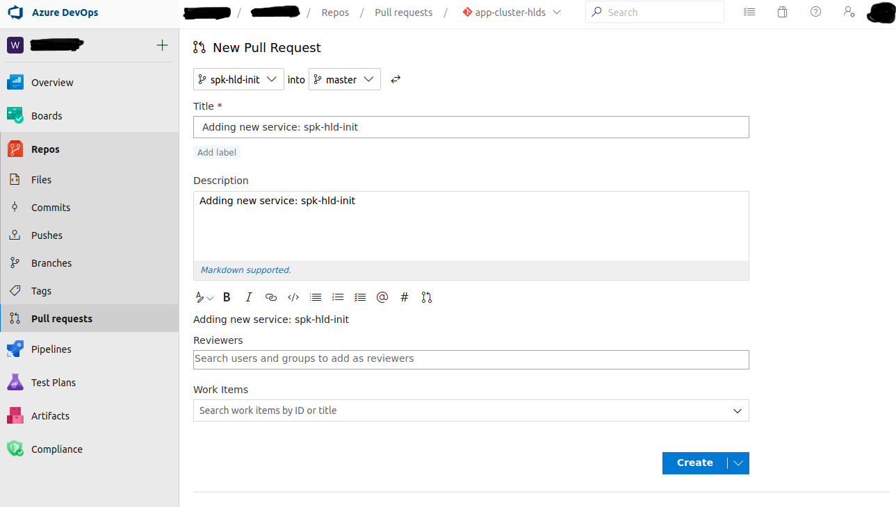
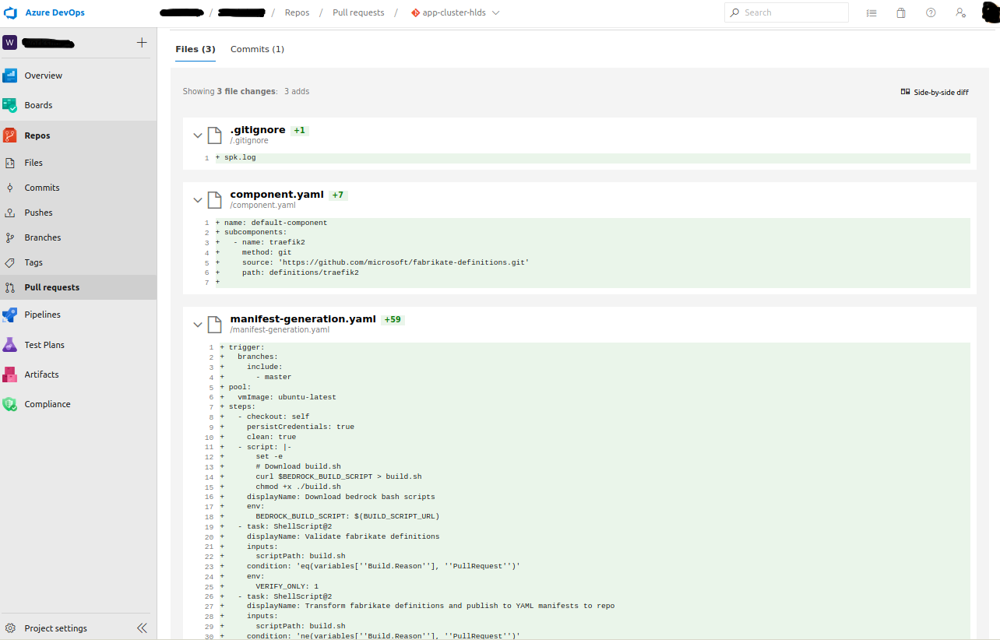
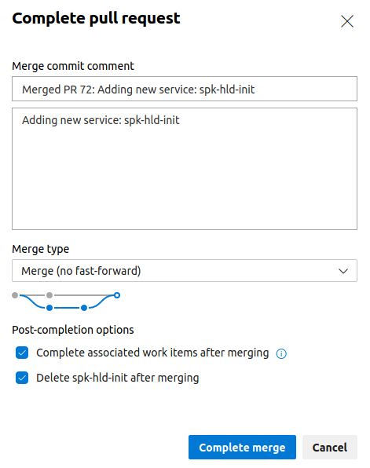
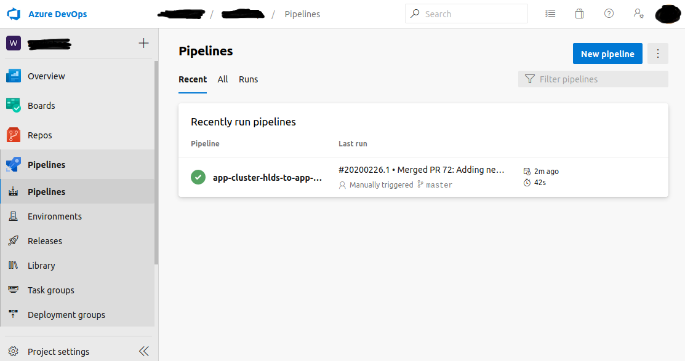
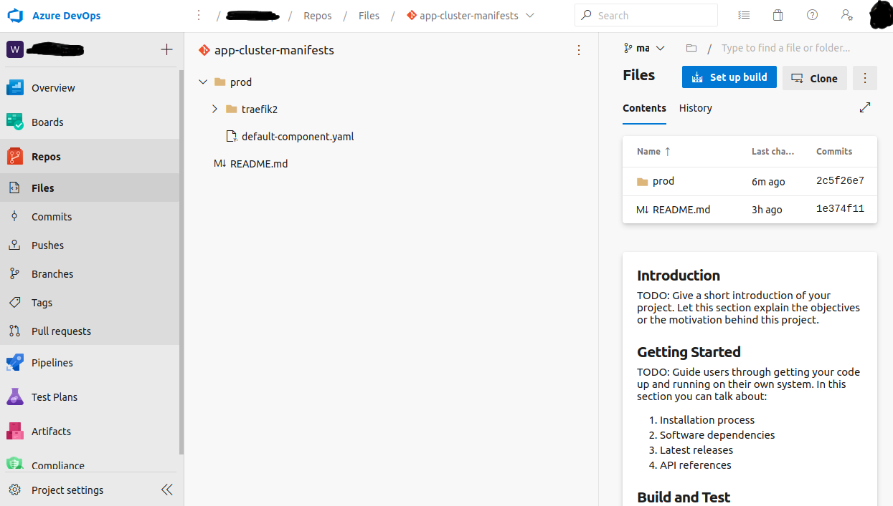

# Setting up an HLD to Manifest pipeline

In [First Workload](./firstWorkload/README.md) we deployed the Azure Voting App using a GitOps workflow by pushing the `azure-vote-all-in-one-redis.yaml` Kubernetes resource manifest file. In [High level Deployment Definitions](./gitops-pipeline.md#deep-dive-high-level-definitions) we learned that, Kubernetes resource manifests that comprise an application definition are typically very complex. These resource manifests, by their YAML nature, are typically very dense, context free, and very indentation sensitive -- making them a dangerous surface to directly edit without introducing a high risk for operational disaster.

We also learned that real world Kubernetes deployments tend to be composed of the combination of many Helm charts. Maintaining and generating various Helm charts can be a challenge and why Bedrock introduced the concept of high level definitions to meet this complexity.

In this walkthrough, we will set up an Azure DevOps pipeline that generates a resource manifest from an HLD definition for the Azure Voting App and pushes it to the Manifest Repository.

## Requirements

There are a few requirements to use this automation:

1. The application code and supporting repositories are hosted on
   [Azure Devops](https://azure.microsoft.com/en-us/services/devops/).
   - If starting from scratch, then first create a
     [new Azure Devops Organization](https://docs.microsoft.com/en-us/azure/devops/user-guide/sign-up-invite-teammates?view=azure-devops),
     then
     [create a project](https://docs.microsoft.com/en-us/azure/devops/organizations/projects/create-project?view=azure-devops&tabs=preview-page).
2. A Manifest Repository inside the Azure DevOps project from Step 1. [Create a repository](https://docs.microsoft.com/en-us/azure/devops/repos/git/create-new-repo?view=azure-devops).
3. An HLD Repository inside the Azure DevOps project from Step 1. [Create a repository](https://docs.microsoft.com/en-us/azure/devops/repos/git/create-new-repo?view=azure-devops).
4. The application will be packaged and run using container images hosted on
   [Azure Container Registry](https://azure.microsoft.com/en-us/services/container-registry/)
5. The user running `spk` has full access to the above resources.
6. The user is running the latest `spk`
   [release](https://github.com/catalystcode/spk/releases).
7. The user has
   [Azure CLI installed](https://docs.microsoft.com/en-us/cli/azure/?view=azure-cli-latest).
8. The user is running [git](http://git-scm.org) version
   [2.22](https://github.blog/2019-06-07-highlights-from-git-2-22/) or later.

**Note**: If a user wishes to store helm charts in the application
   repositories, then all repositories (application, high level definition,
   materialized manifests) must be in the same Azure DevOps Organization AND
   Project. This is what Step 2 and Step 3 are doing.

## Setup SPK

Download the latest version of `spk` from the
[releases](https://github.com/catalystcode/spk/releases) page and add it to your
PATH.

To setup a local configuration:

1. [Generate a Personal Access Token](#generating-personal-access-token)
2. [Create a spk config file](#create-spk-config-file)
3. [Initialize spk](#initializing-spk)

## Generate Personal Access Token

Generate a new Personal Access Token (PAT) to grant `spk` permissions in the
Azure Devops Project. Please grant PAT the following permissions:

- Build (Read & execute)
- Code (Read, write, & manage)
- Variable Groups (Read, create, & manage)

For help, follow the
[guide](https://docs.microsoft.com/en-us/azure/devops/organizations/accounts/use-personal-access-tokens-to-authenticate?view=azure-devops&tabs=preview-page).

## Create SPK config file

Create a copy of `spk-config.yaml` from the starter
[template](https://github.com/CatalystCode/spk/blob/master/spk-config.yaml) or using the [interactive mode](https://catalystcode.github.io/spk/commands/#master@init) for `spk init` command. Be sure to complete
`azure_devops` section with the appropriate values.

Your `azure_devops` section should look similar to this:
```yaml
azure_devops:
  access_token: "8w98gzilabcde6aq5insk7tt64yasprnnetlemvcc2eubzwzwqppl" # This is a Personal Access Token with permission to modify and access the HLD, manifest and infra repos. Leave this empty if project is public. Details for the PAT at: https://github.com/CatalystCode/spk/blob/master/docs/project-service-management-guide.md#generating-personal-access-token
  hld_repository: "https://dev.azure.com/myOrganization/myProject/_git/app-cluster-hlds" # Repository URL for your Bedrock HLDs
  manifest_repository: "https://dev.azure.com/myOrganization/myProject/_git/app-cluster-manifests" # Repository URL for your materialized manifests generated by fabrikate.
  infra_repository: "" # Repository URL that contains your terraform templates to be sed for scaffolding and generating infrastructure deployment templates.
  org: "myOrganization" # Your AzDo Org
  project: "myProject" # Your AzDo project
```

**Note:** This `spk-config.yaml` should not be commited anywhere, as it contains
sensitive credentials. For an alternative approach on how to add secrets to `spk-config.yaml` using environment variables, see these [instructions](https://github.com/CatalystCode/spk#environment-variables).

## Initialize SPK

Run `spk init -f <spk-config.yaml>` where `<spk-config.yaml>` the path to the
configuation file.

**Note:** When running `spk init -f <spk-config.yaml>`, `spk` will copy the
values from the config file and store it into local memory elsewhere. If you
wish to utilize `spk` with another project or target, then you must rerun
`spk init` with another configuration first OR, you may overwrite each commands
via flags.


## Repositories
Our next step is to onboard the repositories that support the
deployment of our services:

1. The high level definition repository (Step 3 from the [Requirements](#requirements))
2. The materialized manifest repository (Step 2 from the [Requirements](#requirements))

### High Level Definition Repository

This repository holds the Bedrock High Level Deployment Definition (HLD) and
associated configurations.

This HLD is processed via [fabrikate](https://github.com/microsoft/fabrikate) in
Azure Devops on each change to generate Kubernetes YAML manifests that are
applied to the Kubernetes cluster by Flux.

#### Initializing the High Level Definition Repository

- Make sure your SPK config points to the HLD repo you created in Step 3 of [Requirements](#requirements). When you change the values in the SPK config, make sure you re-initialize SPK by running `spk init -f <spk-config.yaml>`.
- [Clone the repository.](https://docs.microsoft.com/en-us/azure/devops/repos/git/create-new-repo?view=azure-devops#clone-the-repo-to-your-computer)
- Initialize via `spk`, this will add the fabrikate
  [traefik2](https://github.com/microsoft/fabrikate-definitions/tree/master/definitions/traefik2)
  as the initial sample component. This can be overridden via optional flags.
  ```
  spk hld init --git-push
  ```

**NOTE** `spk hld` command documentation can be found
[here](/guides/hld-management.md).

If the initialization succeeded, you will see a message similar to this:
```
info:    Link to create PR: https://dev.azure.com/myOrganization/myProject/_git/app-cluster-hlds/pullrequestcreate?sourceRef=spk-hld-init&targetRef=master
```

This means that we were able to generate and HLD with the default traefik2 component and all the changes were added to a new branch and are ready to be added to a Pull Request.

To verify run:
```
$ git branch -a
* master
  remotes/origin/HEAD -> origin/master
  remotes/origin/master
  remotes/origin/spk-hld-init
```
As you can see we now have a `spk-hld-init` branch.

Go to the "Link to create a PR" that we got earlier after running the `spk hld init --git-push` command. You will see:



If you scroll down, you will see several files were added: `component.yaml` and `manifest-generation.yaml`. These files contain the information for our traefik component and for the pipeline.



Click "Create" to create the PR. Then click "Complete". Finally click "Complete merge":


Your changes should now be in the `master` branch. Pull the latest changes:
```
$ git pull origin master
remote: Azure Repos
remote: Found 1 objects to send. (3 ms)
Unpacking objects: 100% (1/1), 238 bytes | 238.00 KiB/s, done.
From ssh.dev.azure.com:v3/myOrganization/myProject/app-cluster-hlds
 * branch            master     -> FETCH_HEAD
   32b0b14..3ee2da1  master     -> origin/master
Updating 32b0b14..3ee2da1
Fast-forward
 .gitignore               |  1 +
 component.yaml           |  6 ++++++
 manifest-generation.yaml | 58 ++++++++++++++++++++++++++++++++++++++++++++++++++++++++++
 3 files changed, 65 insertions(+)
 create mode 100644 .gitignore
 create mode 100644 component.yaml
 create mode 100644 manifest-generation.yaml
```

## Deploy Manifest Generation Pipeline

Deploy a manifest generation pipeline between the high level definition repo and
the materialized manifests repo. Assuming you have configured `spk`, you can run
this without flag parameters from your HLD repo root:

```
$ spk hld install-manifest-pipeline
```

You can view the newly created pipeline in your Azure DevOps project:


Once the pipeline finishes running successfully, you will see that the manifests have been generated and pushed to the `app-cluster-manifests` repository:


After some time, flux will apply the changes:
```
$ kubectl get pods
NAME                        READY   STATUS              RESTARTS   AGE
traefik2-6f8ddc69cc-79n4g   0/1     ContainerCreating   0          8s
```

And we can also confirm the service is available:
```
$ kubectl get services
NAME         TYPE           CLUSTER-IP    EXTERNAL-IP     PORT(S)                      AGE
kubernetes   ClusterIP      10.0.0.1      <none>          443/TCP                      21h
traefik2     LoadBalancer   10.0.209.68   137.135.15.52   80:31328/TCP,443:30149/TCP   19h
```
