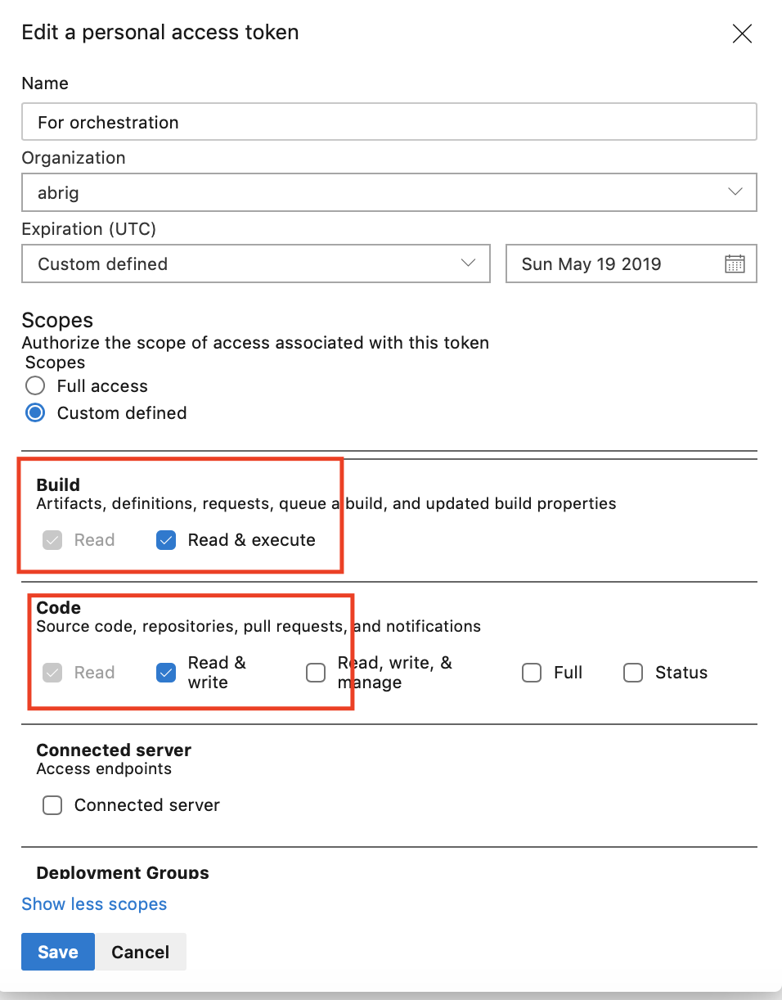

# Creating Azure DevOps Repos for Bedrock GitOps

## Instructions
Follow instructions to install the [Azure CLI DevOps Extension](https://github.com/Microsoft/azure-devops-cli-extension)

## 1. Create a new project in Azure DevOps via Azure CLI
Once installed create a project in Azure DevOps
```
$ az devops project create -n $PROJECT_NAME
```

## 2. Create a Personal Access Token
1. In Azure DevOps click the `Security` submenu after clicking your profile name in the upper right corner. Next choose `Personal Access Tokens` on the left window menu. Finally click `+ New Tokens`

2. Make sure your PAT has appropriate permissions to read and write Azure DevOps builds and code.


## 3. Create HLD & Manifest Repositories
Next, create high level deployment defintion and manifest repositories in your new ADO project
```
$ az repos create --name $HLD_REPO_NAME
$ az repos create --name $MANIFEST_REPO_NAME
```

Then, import a sample HLD repo to your ADO from a shared GitHub repos
```
$ az repos import create --git-source-url $SAMPLE_HLD_REPO_PATH --repository HLD_REPO_NAME
```
We provide a sample HLD GitHub repo [here](https://github.com/samiyaakhtar/aks-deploy-source) 

The imported HLD example contains an Azure Pipelines yaml file that will activate checks on pull requests and merge to master branch. It will also import a `build.sh` script that the [azure-pipelines.yml](README.md#azure-pipelines-build-yaml) file relies on. These processes are critical to maintaining the _release flow_.

## Reference
* https://docs.microsoft.com/en-us/azure/devops/pipelines/repos/azure-repos-git?view=azure-devops