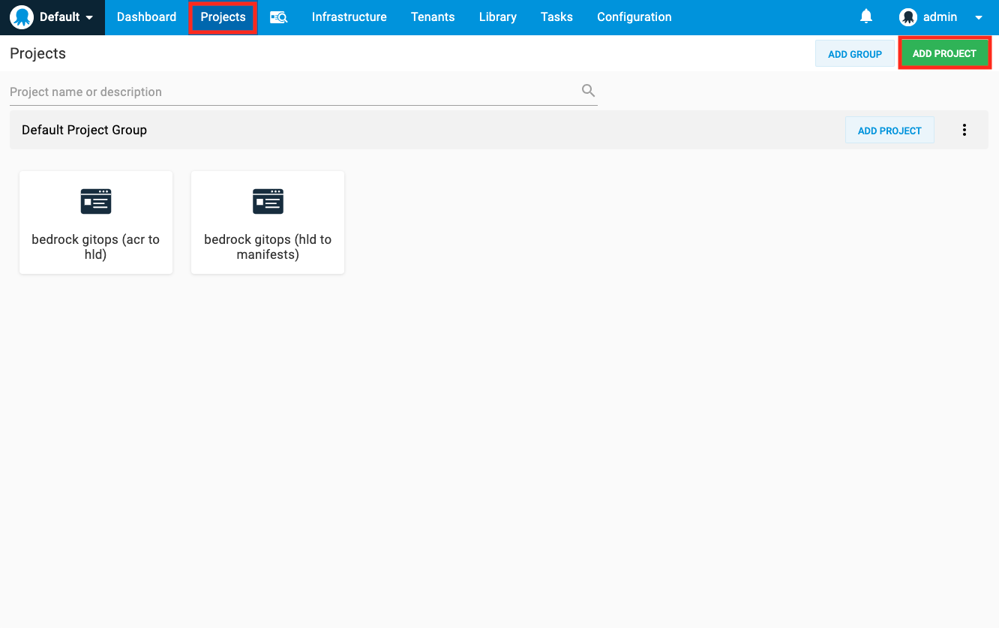
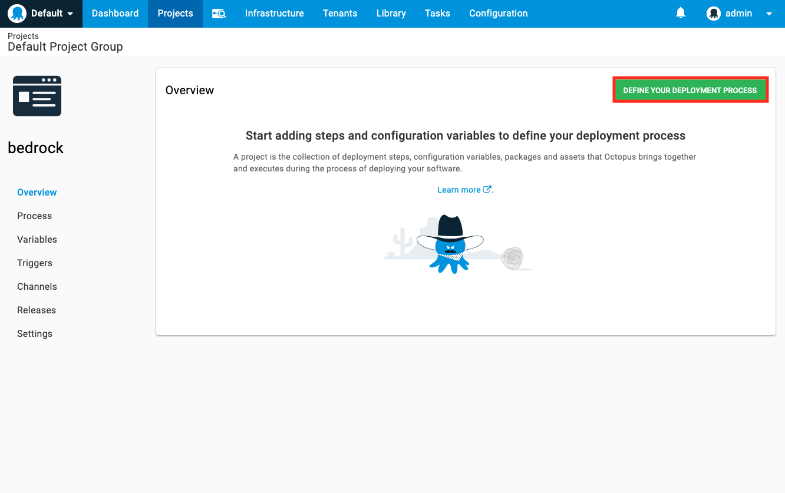
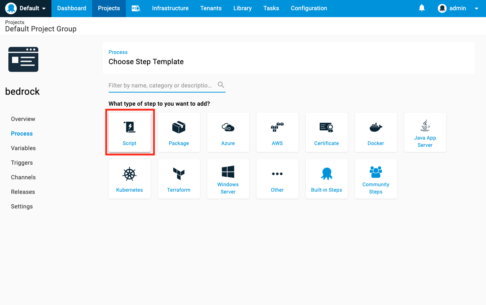
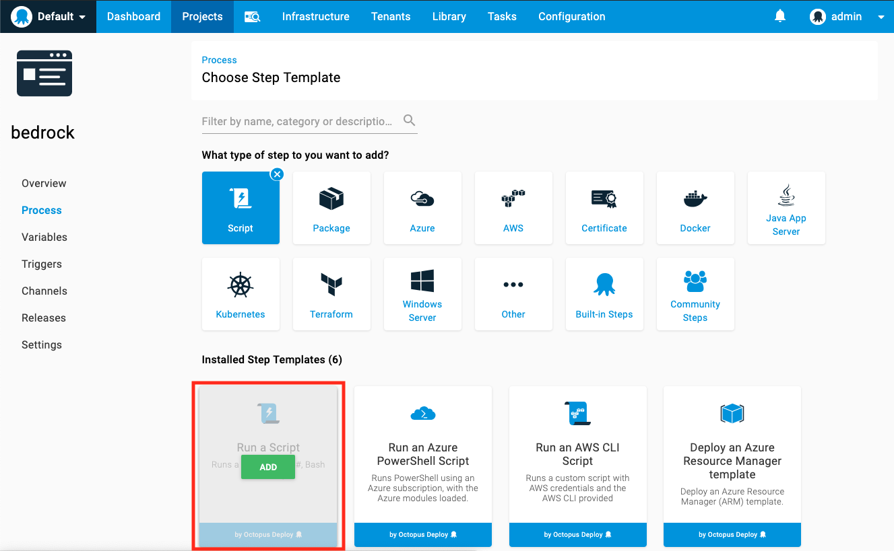
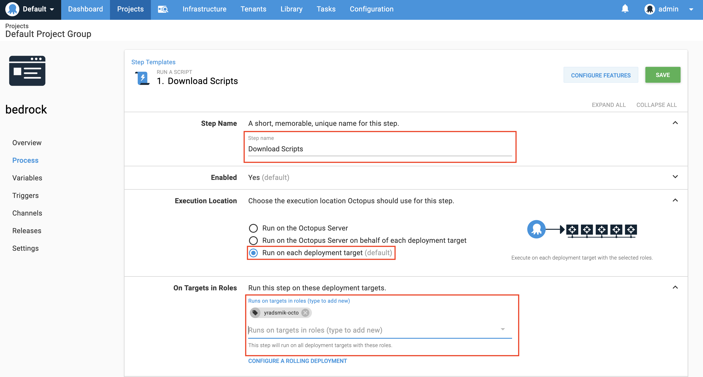
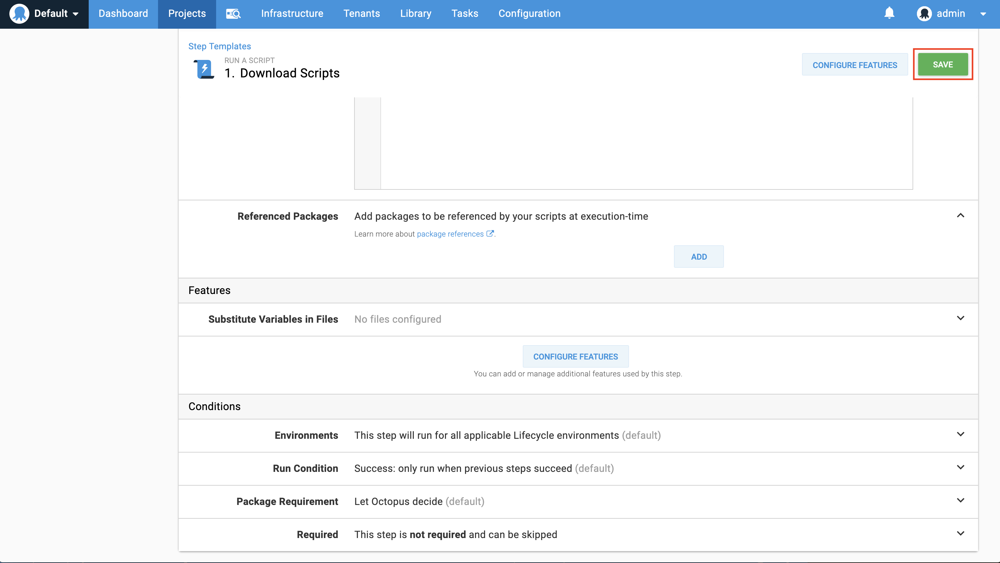
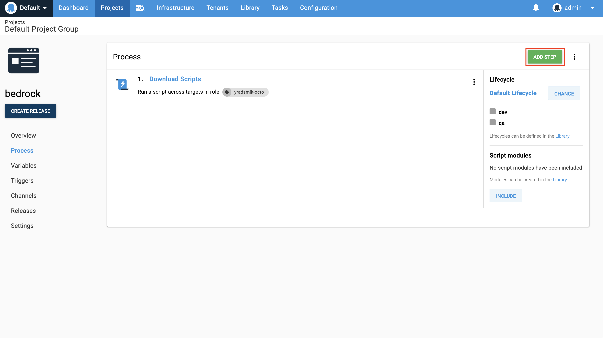
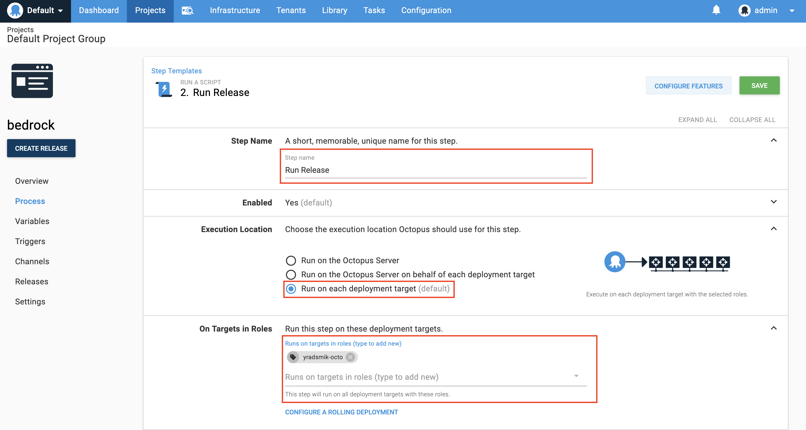
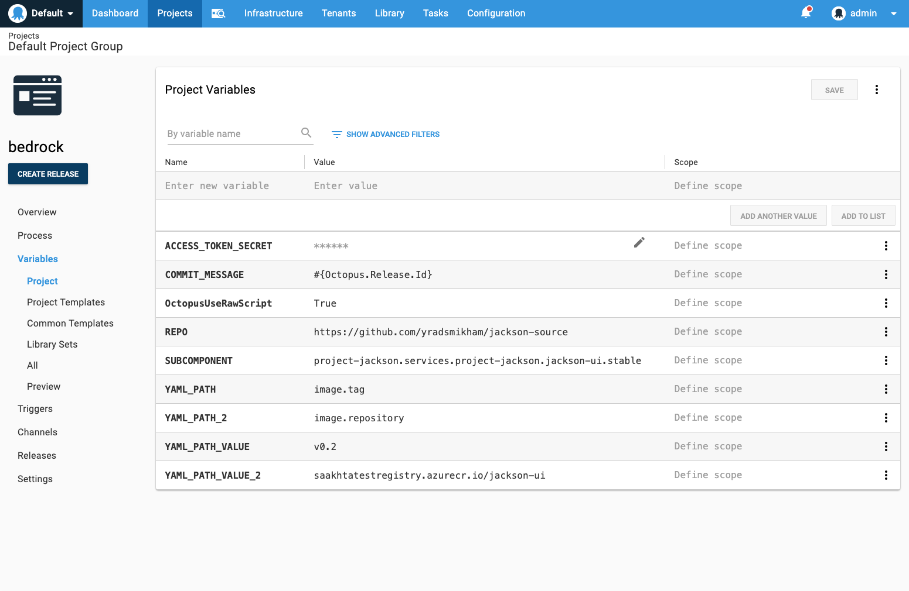

# Octopus Deploy: Container Image Tag Release Pipeline

In addition to the [manifest generation pipeline](https://github.com/Microsoft/bedrock/blob/master/gitops/azure-devops/ManifestGeneration.md), Octopus Deploy can help extend the pipeline by providing a way for container promotion.

If you are new to Octopus Deploy, we **strongly** recommend setting up the [manifest generation pipeline](OctopusDeploy.md) using Octopus Deploy first. This is because the guide will assume that you already have part of your Octopus Infrastructure (e.g. Deployment Targets, Target Statuses, Environments, etc.) in place.

This guide will assist you with constructing the following image tagging release pipeline:


## Prerequisites

1. An _Octopus Server_ and an _Octopus account_. The [Azure Marketplace](https://azuremarketplace.microsoft.com/en-us/marketplace/apps/octopus.octopusdeploy) supports Octopus Deploy under a 45-day free trial, and will serve as a good starting point for deploying your first Octopus Server. For more information on gettings started, please visit [here](https://github.com/Microsoft/bedrock/blob/master/gitops/octopus/OctopusDeploy.md#getting-started).
2. _High Level Deployment Description_: Either your own [Fabrikate](https://github.com/Microsoft/fabrikate) high level definition for your deployment or a sample one of ours.  We provide a [sample HLD repo](https://github.com/samiyaakhtar/aks-deploy-source) that builds upon the [cloud-native](https://github.com/timfpark/fabrikate-cloud-native) Fabrikate definition. The one used in this example can be found [here](https://github.com/yradsmikham/fabrikate-go-server).

## Setup

### 1. Create a new Octopus Project

Assuming this is not your first time using Octopus Deploy, let's start off by creating a new project.




### 2. Define Deployment Process

You should be taken to the project page where you have the option to define your Deployment Process.



Add a `Script` step.





Create a step using a bash script called `Download Scripts`. The purpose of this step is to download the `build.sh` from the offcial [Microsoft/Bedrock](https://github.com/Microsoft/bedrock/blob/master/gitops/azure-devops/build.sh) repo.

You want to configure the execution location to run on each deployment target with a selected role (bash scripts cannot run on the Octopus Server). If you have not created a role before, you can create a new role by simply typing one in.



Next, under the Script section, select `Inline source code`, and paste in the following bash script:

```
# Download build.sh
curl https://raw.githubusercontent.com/Microsoft/bedrock/master/gitops/azure-devops/build.sh > build.sh
chmod +x ./build.sh
```

Again, this will download the `build.sh` from the Microsoft/Bedrock repo, which will be sourced in the next step.


On the top right corner, click on `Configure Features`, which will provide a pop-up to enable specific features for the script. Select `Substitute Variables in Files` since the `build.sh` _does_ involve using environment variables. Then, click `OK`.


Do not forget to `Save` your step!



Navigate back to the Process page to add another Step.





Again, you will add another bash script step, but instead the script will execute the following:

```
# Define Environment Variables using Octopus syntax
ACCESS_TOKEN_SECRET=#{ACCESS_TOKEN_SECRET}
REPO=#{REPO}
BRANCH=#{BRANCH}
COMMIT_MESSAGE=#{COMMIT_MESSAGE}
YAML_PATH=#{YAML_PATH}
YAML_PATH_VALUE=#{YAML_PATH_VALUE}
SUBCOMPONENT=#{SUBCOMPONENT}

# Reset Environment
rm -rf fab*

# Source build.sh
. build.sh --source-only

# Initialization
verify_access_token
init
helm init
get_os

# Fabrikate
get_fab_version
download_fab
export PATH=$PATH:$HOME/fab

# Clone HLD repo
git_connect

echo "FAB SET"
fab set --subcomponent ${SUBCOMPONENT} ${YAML_PATH}=${YAML_PATH_VALUE}

echo "GIT STATUS"
git status
git fetch

echo "GIT ADD"
git add -A

# Set git identity
git config user.email "admin@azuredevops.com"
git config user.name "Automated Account"

echo "GIT COMMIT"
echo "COMMIT MESSAGE: $COMMIT_MESSSAGE"
git commit -m $COMMIT_MESSAGE

echo "GIT PUSH"
git_push

```


Hit `Save`.

Project variables need to be specified in order for the scripts to run. For this pipeline, there are a few variables that are considered:

```
ACCESS_TOKEN_SECRET: the personal access token from your git repository

REPO: the link to the HLD repo (e.g. https://github.com/yradsmikham/fabrikate-go-server)

BRANCH: the branch of the Fabrikate HLD repo (e.g. master)

COMMIT_MESSAGE: custom message used when committing and pushing to git

SUBCOMPONENT: the subcomponent within your Fabrikate HLD that should be manipulated

YAML_PATH: the yaml path to the subkey to set (e.g. data.replicas)

YAML_PATH_VALUE: the value to the subkey

OctopusUseRawScript: parameter that allows raw scripting to be used in the Deployment Target
```

**Note**: The personal access token is used to commit and push to the Fabrikate HLD repo. (This variable can be censored by right-clicking on the value column and changing the "type" to sensitive.)

**Note**: In Octopus Deploy, variables cannot have values that contain spaces or special characters. Thus, the `COMMIT_MESSAGE` must be a single string or if using spaces and/or special characters, you will need to hardcode the message in the inline source code.

**Note**: It is important to enable [Raw Octopus](https://octopus.com/blog/trying-raw-octopus), or "Raw Scripting" for this pipeline because it is a default configuration to have deployments run [Calamari](https://octopus.com/docs/api-and-integration/calamari) when using Octopus Deploy, and this will interfere with "resetting" the Deployment Target. For this reason, raw scripting is used to allow the script steps to execute directly through the opened SSH connection without any extra wrapping or bootstrapping that comes naturally with Octopus. To do this, it is important to add the variable `OctopusUseRawScript` and set it to `True`.



### 3. Create and Deploy Release

You're now at the point to create and deploy a Release! Navigate to `Releases` on the left side panel and click on `Create Release`.


This is optional, but you can specify notes for the Release.


Be sure to click `Update Variables` to ensure that your environment variables exist. It is important to note that if changes are made to the Project Variables, you will need to update the variables in the Release snapshot before deploying.


When you are finished, click `Deploy`, and this will deploy to environments that you have specified.


Your deployment should be in progress now.


You can track the progress of your deployment and view logs on the `Task Log` tab.


### 4. Promotion

When your Release runs successfully, you have the option to promote to the next environment (e.g. qa).


**Note**: You will need to prepare your `qa` environment before deploying if you have not already done so. This means that you should have Deployment Targets specified and labeled `qa` if used in your `qa` environment.


