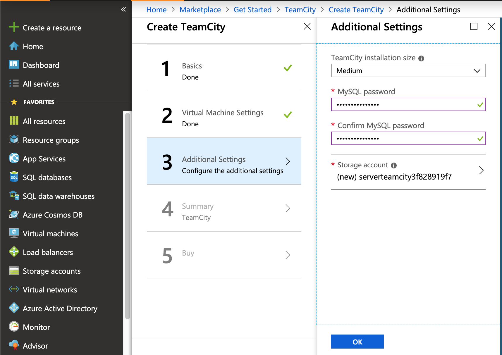
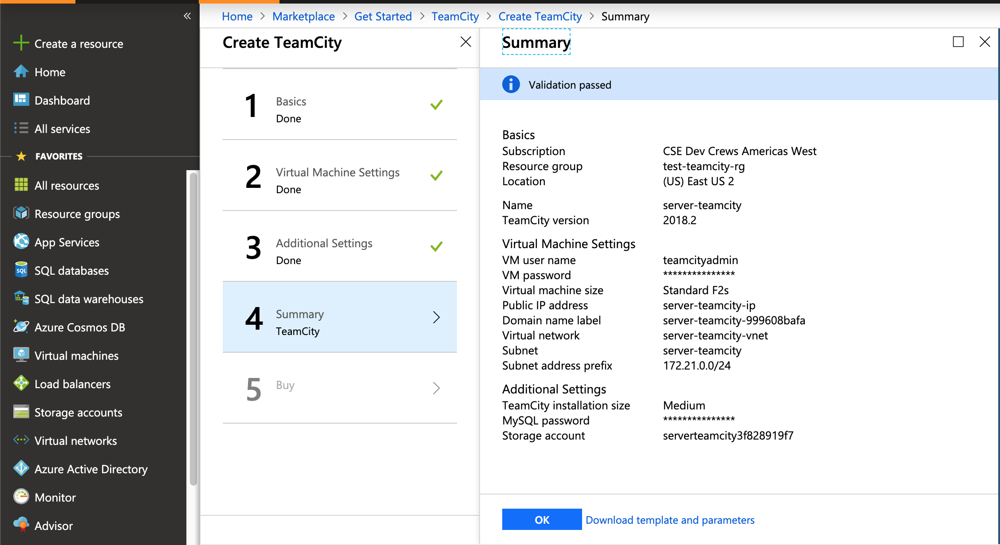
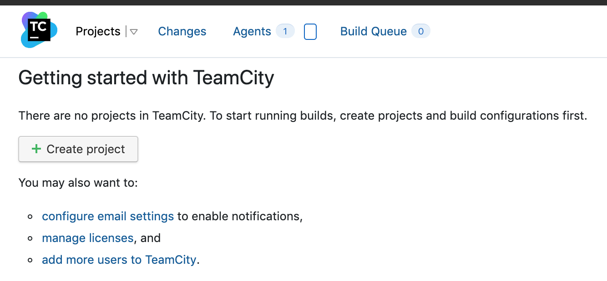
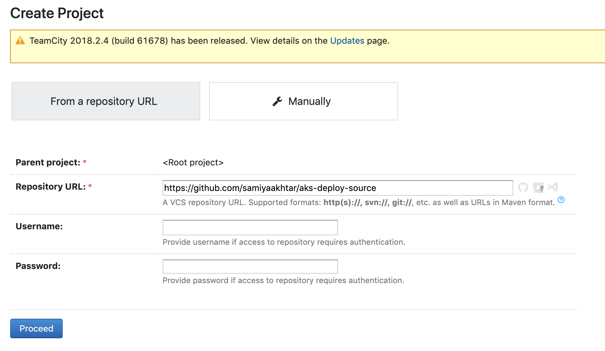
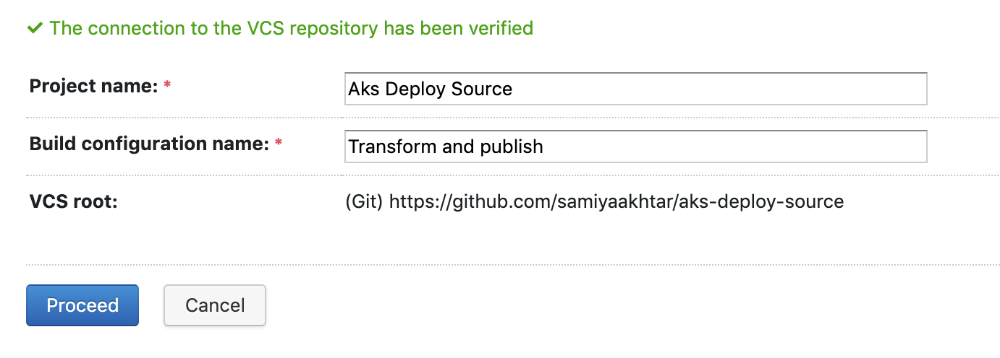
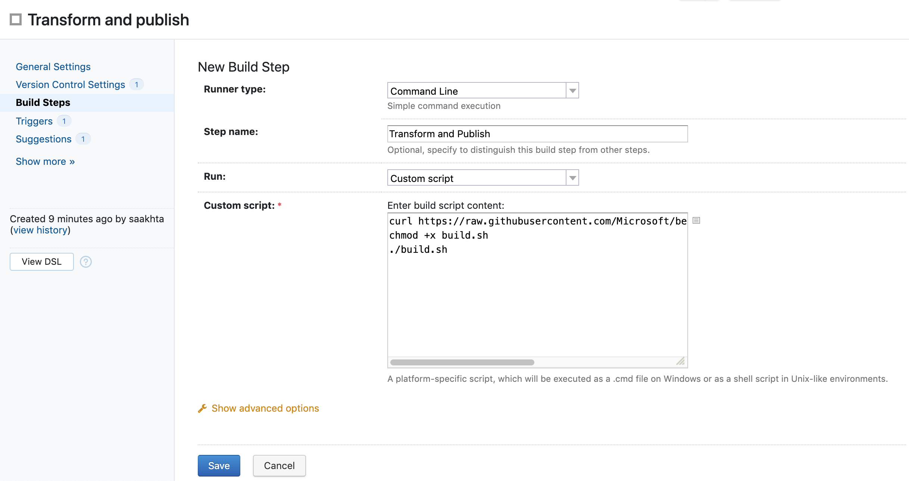
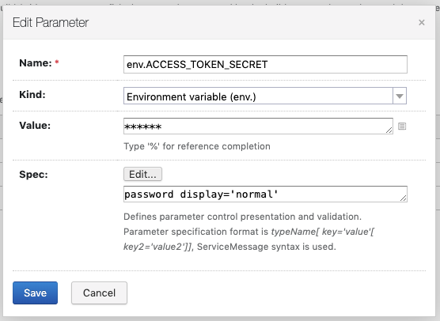
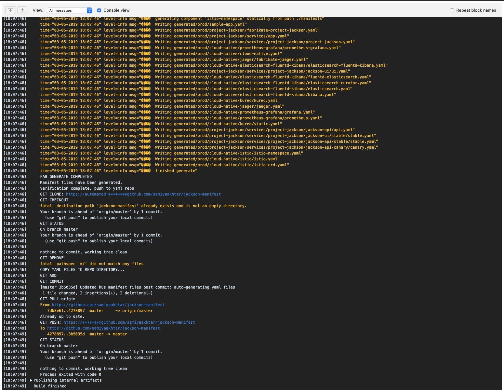

# TeamCity

TeamCity is a build management and continuous integration server developed by [JetBrains](https://www.jetbrains.com/teamcity/). TeamCity is available in the [Azure Marketplace](https://azuremarketplace.microsoft.com/en-en/marketplace/apps/jetbrains.teamcity?tab=Overview). Follow the instructions below to deploy an instance of TeamCity on your Azure cloud to run continuous integration builds.

## Getting Started

In the instructions below, the goal is to setup a working build pipeline for generating manifest files for a high level definition repo. Make sure to have the high level definition setup correctly, as outlined in other docs [here](../PipelineThinking.md). The pipeline we're about to setup in TeamCity will be triggered by a change that happens in the high level definition repository, and it will generate files which will be committed into the manifest repository. 

1. Login to [Azure Marketplace](https://ms.portal.azure.com/#blade/Microsoft_Azure_Marketplace/GalleryFeaturedMenuItemBlade/selectedMenuItemId/home) and search for TeamCity. 
Click on `TeamCity` > `Create`

    

2. Configure settings for the TeamCity server by entering an appropriate name, selecting (or creating a new) resource group and location, and press `OK`.

    

3. Configure settings for the Virtual Machine by entering an appropriate username and a strong password. Make sure to select a subnet and domain name label (it should be automatically filled in). Press `OK` to proceed.

    

4. Enter a strong password for MySEL and make sure a storage account is selected or automatically filled in. Press `OK` to proceed. 

    

5. It should show a summary of all the settings about to be applied. Press `OK` to continue. 

    

6. In this step it will prompt you for any payments, if needed. Agree to the terms of conditions and press `Create`. 

7. Click on the notification that says `Deployment in progress` and you can view the status of your deployment which is underway. Wait till this deployment is complete, then navigate to the `Outputs` tab on the left column. 

    

8. When deployment is complete, the `Outputs` tab will give you a URL where TeamCity is deployed and the ssh command. Copy the `teamcityURL` and open it in the browser on another tab. 

    

9. When you visit this URL, for example `http://server-teamcity-999608bafa.eastus2.cloudapp.azure.com/showAgreement.html`, it will display the licence agreement for JetBrains TeamCity. Press `Accept` and `Continue`. 
10. Next, it will prompt you to create a new administrator account. Enter a username and secure password, then press `Create Account`. 

    

11. Next, it will prompt you to fill in your profile. Complete your profile and navigate to `Projects` in the top left. It should display an option to Create a project. 

    

12. Create the project from the repository URL, and enter credentials if it's not a public repository. Click on `Proceed`. 
    
    

13. Enter a name for the build and click on `Proceed`. 
    
    

14. After this step, it will auto-detect build steps and prompt you to configure it, and if none are present you may configure it manually. Click on `configure build steps manually`, since we're planning on using the build script provided by  [`Microsoft` / `Bedrock`](https://github.com/microsoft/bedrock). 
15. Select `Command Line` from the dropdown for `Runner Type`. Enter a step name and select `Custom script` for `Run`. The script we're using below downloads the Bedrock GitOps build script, which downloads all essential tools needed to convert high level definition files into Kubernetes manifest yaml files, and pushes them into a manifest repo. All you need to use are the following simple commands for `Custom script`: 
    ```
    curl https://raw.githubusercontent.com/microsoft/bedrock/master/gitops/teamcity/build.sh > build.sh
    chmod +x ./build.sh
    ./build.sh
    ```
    

16. Press `Save` and click on `Parameters` on the left column. 
    

17. Click on `Add new parameter`, and add the following variables under `Environment Variables`:
    - `ACCESS_TOKEN_SECRET`: Get an access token from GitHub/Azure DevOps where your repo is hosted, so that the script can have access to push to the remote manifest yaml repository. You should use the password type for this variable for security purposes (as shown below). 
        
    - `COMMIT_MESSAGE`: Since TeamCity does not have a variable that can provide the exact commit message, enter something valuable, such as "Auto-generated yaml files"
    - `REPO`: Set this to the manifest repo, such as `https://github.com/samiyaakhtar/jackson-manifest`
        

18. Click on `Run` to do a test run for this configuration! 

You should be able to see logs from the build that just completed, and in the end it should push manifest files to the repository.



## Disadvantages

- Upgrading from one version to another is a time consuming task with TeamCity 
- Not free if you need more than 3 agents and over 100 builds
- Unintuitive user interface, less customizability, fewer hooks, less variables available as part of build processes (such as commit messages can't be fetched from a repo that triggered it)


